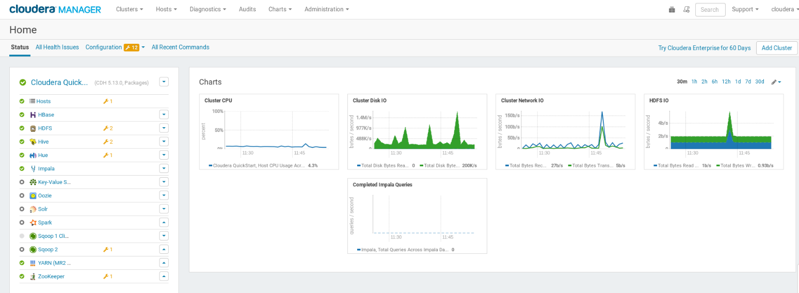
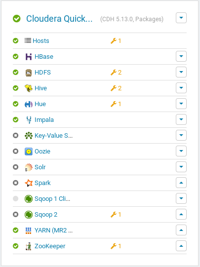

# HBase exercise

## Introduction
This exercise was completed in preparation for the Big Data course at [University of Zanjan](https://www.znu.ac.ir/en) in 2021.

For this exercise, it is necessary to launch cloudera manager (CM), it is necessary to change the configuration of the cloudera virtual machine and increase its RAM size to at least 8GB and the number of CPUs to at least 2. (By default, it has 4GB RAM and 1 CPU. After making these changes, we start the virtual machine.

On the desktop, there is an icon called Launch Cloudera Express, by clicking on it, the cloudera manager preparation operation is performed, this is only needed once and there is no need to repeat it the next time we start the virtual machine. After completing the operation, which takes a few minutes, you can connect to it by clicking on the cloudera manager icon or entering the following url in the browser.

http://localhost:7180/

The username and password is cloudera. Its first page is similar to the following image. On the left side of the image, you can see various services that can be worked with through CM, including HBase, HDFS, Hive, Impala, etc. Also, the green tick icon next to them shows that the service is currently in start status and can be used, otherwise the service is down and cannot respond to requests.

After launching the CM, these services will come up automatically after a few minutes, but if this does not happen, it is necessary to start the following services in order.
- Start HDFS
- Start YARN
- Start Hive
- Start ZooKeeper
- Start HBase

The services related to HBase include the following three services:
- Master
- Region Server
- Thrift Server

All three must be in Good Health status, so that the exercise can be started.

Now it's time to answer to the questiones has been mentioned in [HBase practice](LabPractice4_HBase.pdf)

 
---

The report of the work have done is [here](HBase-report.pdf).
